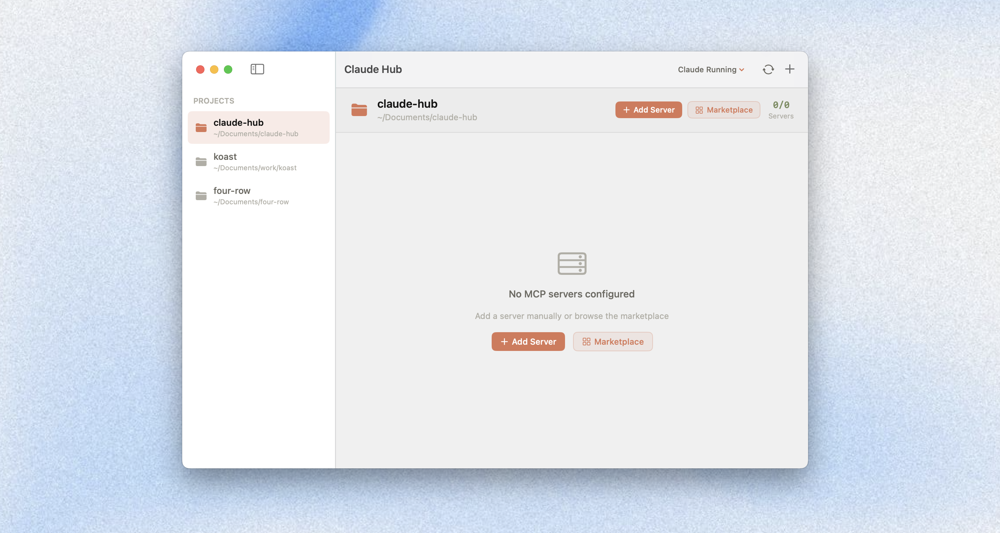

# Claude Hub

Native macOS app for managing MCP servers, tools, and Claude Desktop instances per project.



## Why

Claude Desktop uses one global MCP config. If you work on multiple projects with different servers and secrets, you're constantly editing that file. Claude Hub fixes that — each project gets its own servers, secrets, and tool toggles.

## Features

**Per-project MCP management** — Each project has its own servers, env vars (`.env`), and tool-level toggles. A gateway aggregates everything into a single endpoint for Claude Desktop. You can enable/disable individual tools, not just whole servers.

**Per-project Claude Desktop isolation** — Run separate Claude Desktop instances per project using `--user-data-dir=~/claude-{project-name}`. Multiple projects can have Claude running simultaneously. Launch shared or isolated from the toolbar menu.

**MCP Marketplace** — Browse the [official MCP registry](https://registry.modelcontextprotocol.io), search by category, and add servers with pre-filled commands. Supports npm, PyPI, and Docker packages.

## Install

```bash
git clone https://github.com/marks97/claude-hub.git
cd claude-hub
./install.sh
```

Requires macOS 14+, Node.js 18+, Swift 5.10+, and [Claude Desktop](https://claude.ai/download).

## License

[MIT](LICENSE)
